# 常见数据结构示例图

## **图片来自liuyubobobo**

### (动态)数组
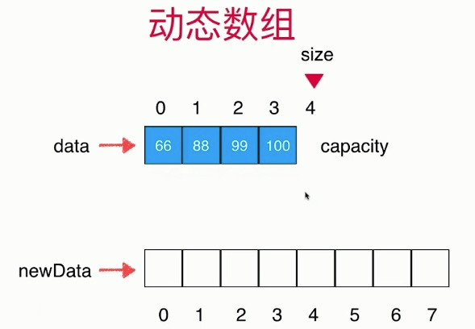

### (单向)链表
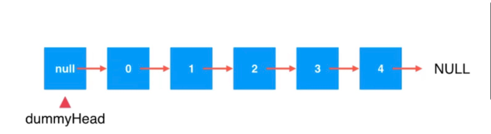
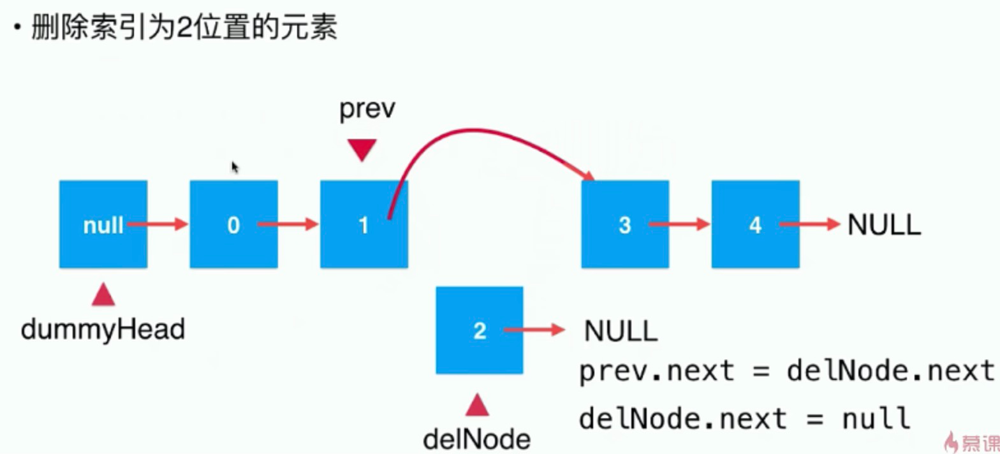

### 队列
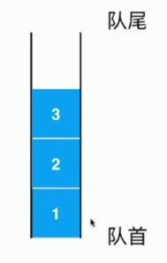 | 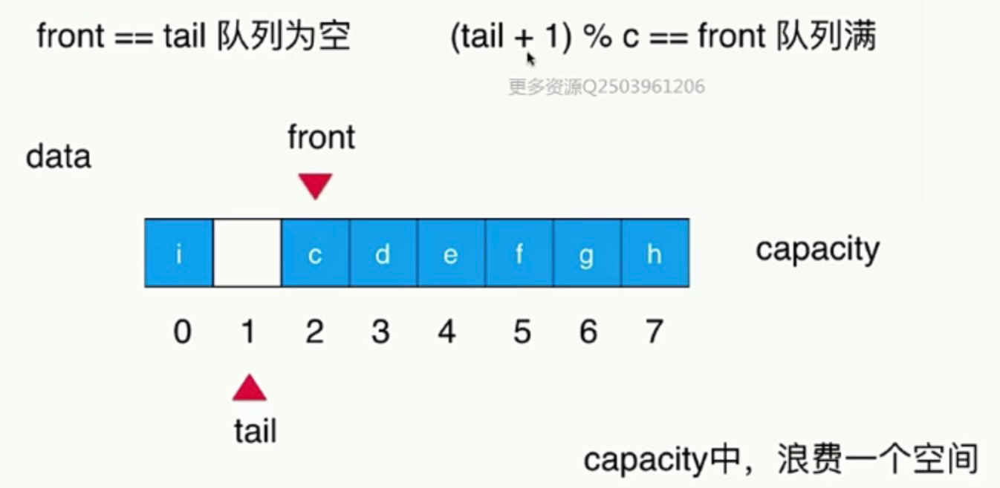
---|---

### 栈

### 二分搜索树
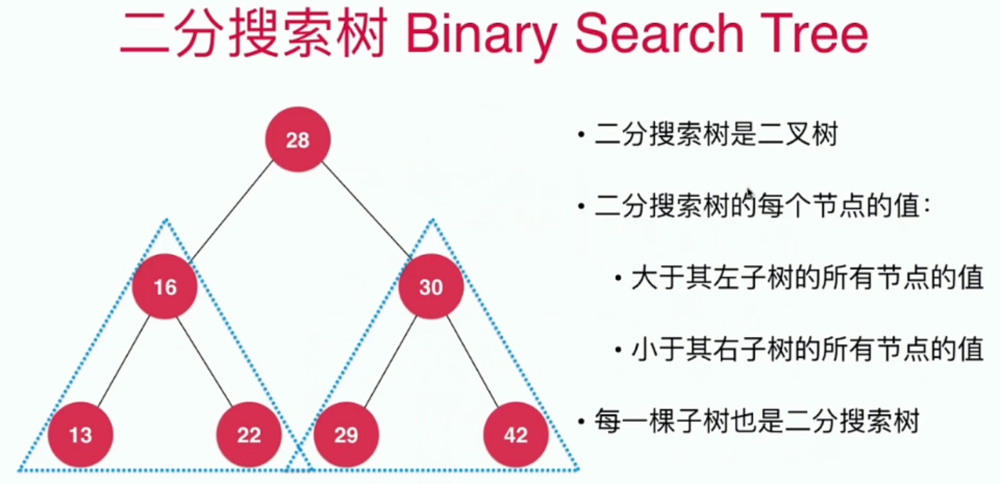|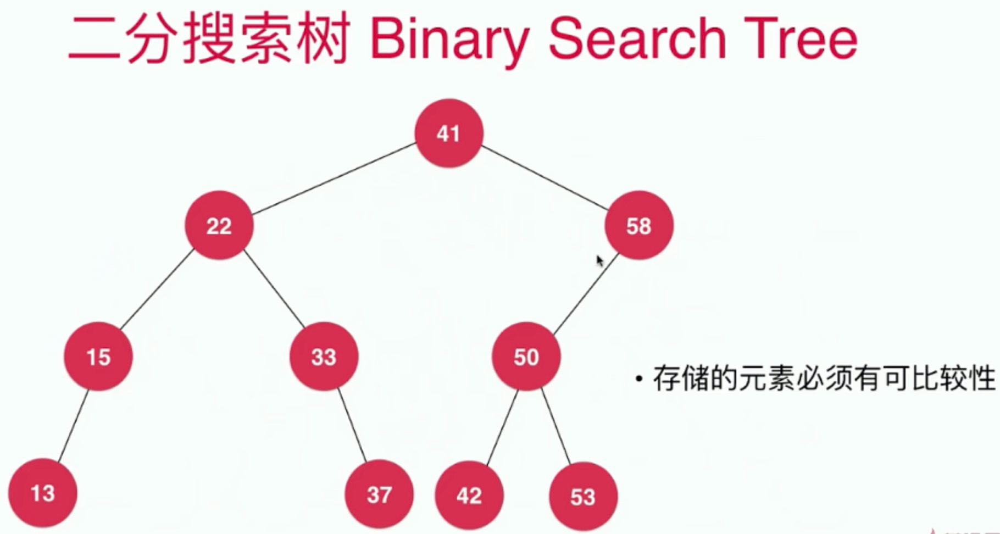
---|---
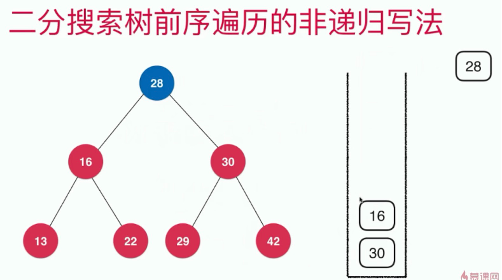|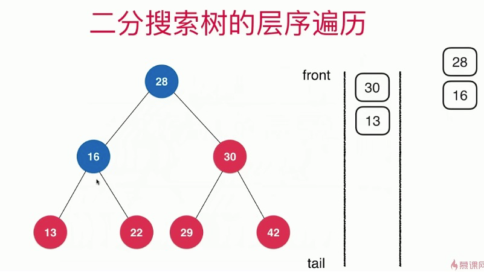

### 堆
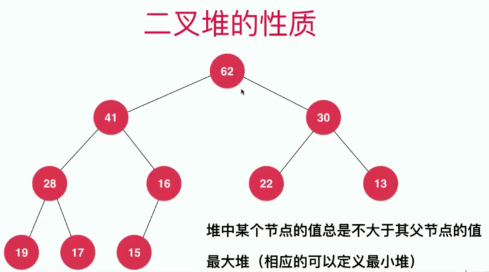|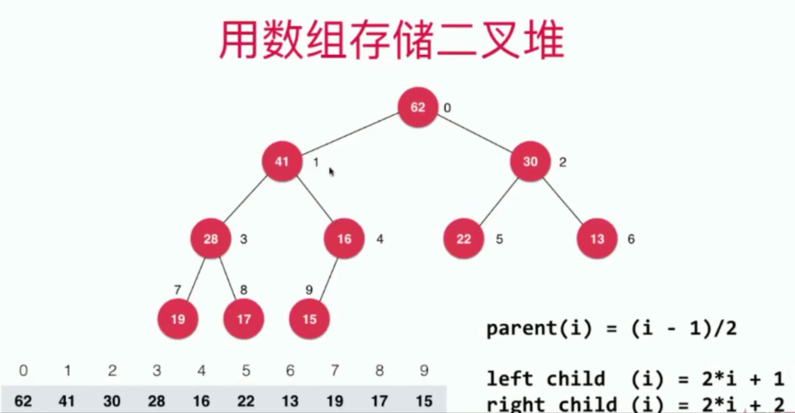
---|---
|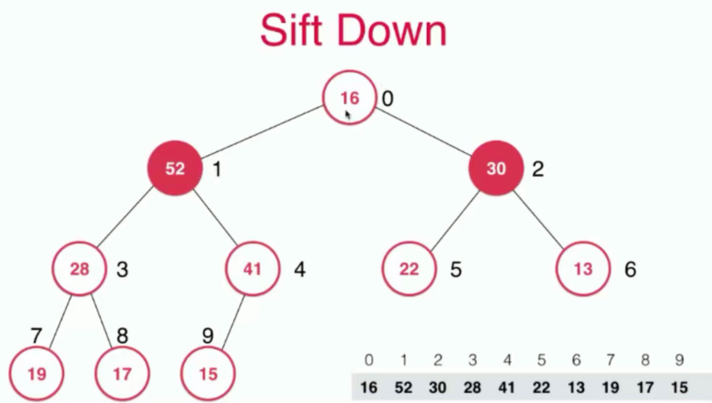
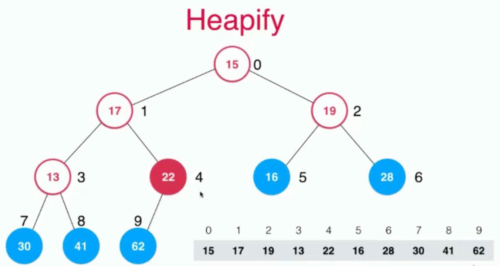

### 优先队列

### 线段树（区间树）
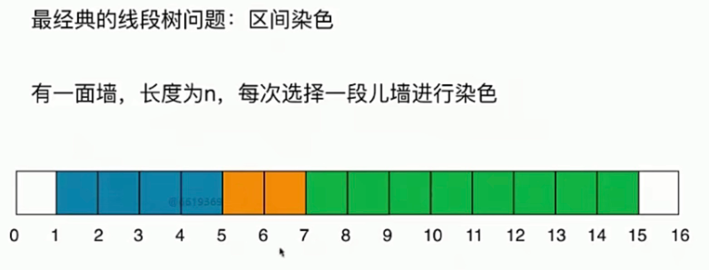

### Trie
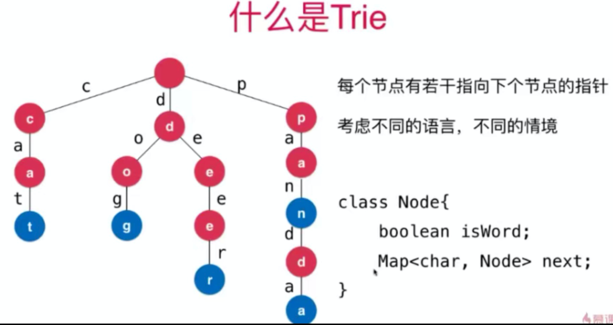

### 并查集
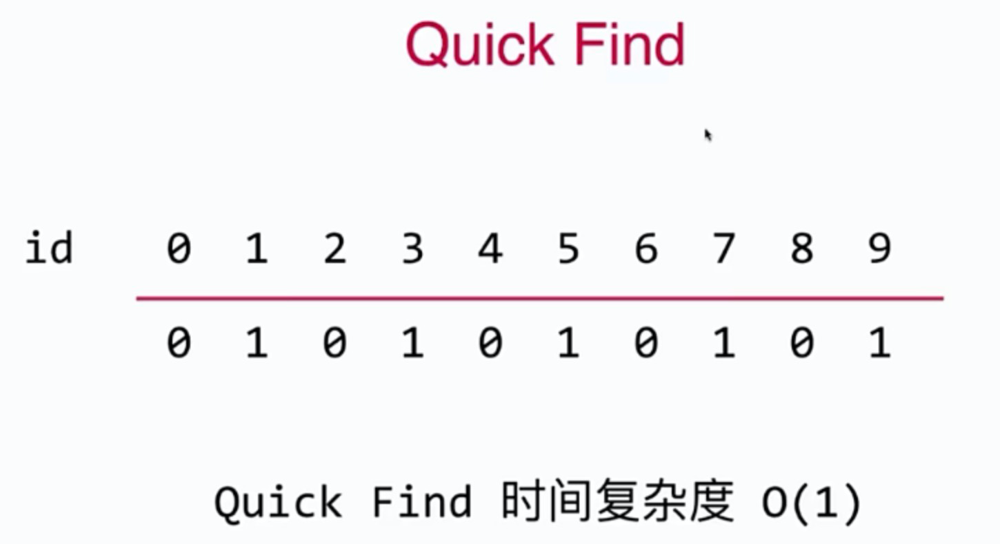|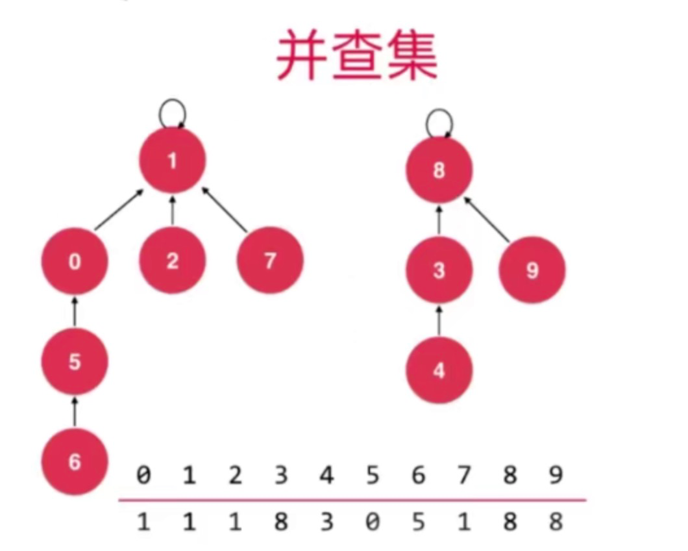
---|---
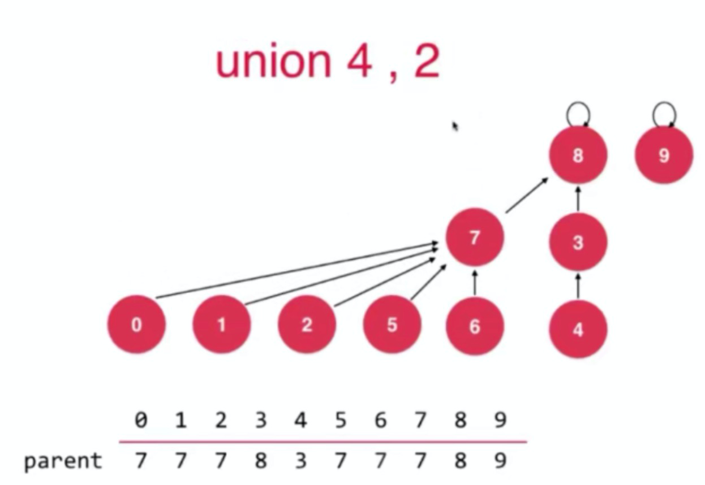|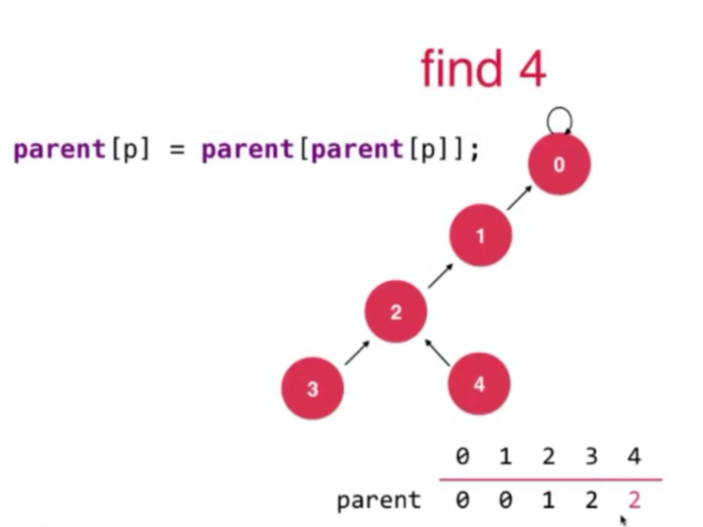

### 红黑树

### 